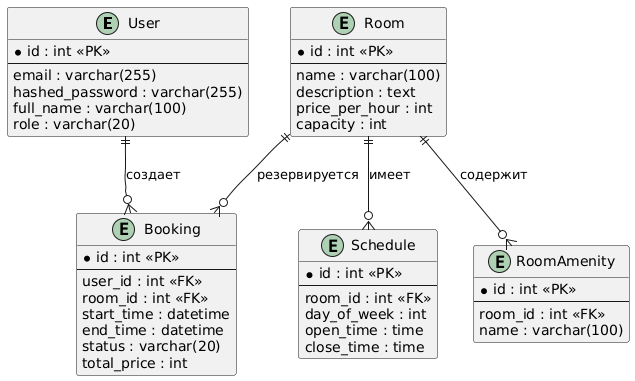
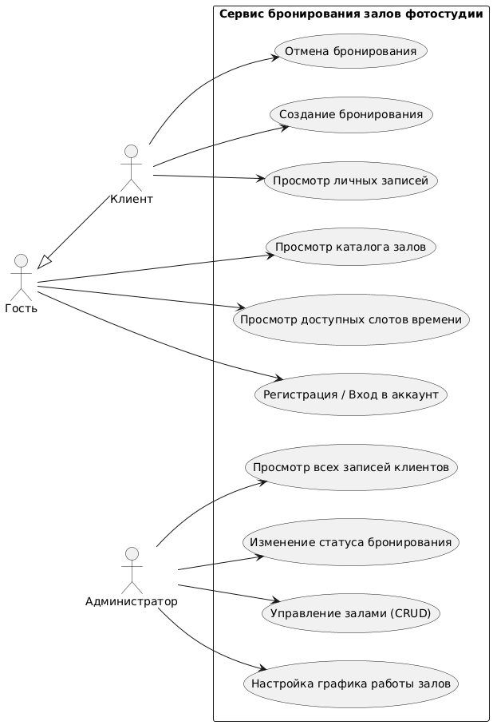

# Онлайн-сервис бронирования залов фотостудии (SPACE)

Проект по дисциплине «Технологии веб-программирования» (Траектория «Юпитер»).

## 1. Команда и роли
- **Backend-разработчик:** Александр — проектирование БД, бизнес-логика слотов, авторизация, REST API на FastAPI.
- **Frontend-разработчик:** Даниэль — клиентский интерфейс, маршрутизация, формы, работа с API на React.

## 2. Предметная область и специфика
Сервис бронирования помещений (залов фотостудии) с почасовой арендой.
- **Динамический расчет свободных слотов на стороне Backend:** сервер анализирует расписание работы зала за вычетом уже существующих подтвержденных броней и отдает фронтенду массив доступных часов.
- **Защита от овербукинга:** исключение пересечения интервалов времени и двойного бронирования на уровне транзакций базы данных.

## 3. Стек технологий
- **Backend:** Python 3.11+, FastAPI, SQLAlchemy 2.0 (async), Alembic, Pydantic v2
- **База данных:** PostgreSQL
- **Frontend:** React, Vite, Tailwind CSS

## 4. Архитектура приложения
Трехзвенная архитектура (Клиент — Сервер — База данных):
1. **Frontend (SPA):** пользовательский интерфейс, формы валидации, календарная сетка свободных часов, личный кабинет клиента и администратора.
2. **Backend (FastAPI REST API):** 
   - Модуль аутентификации (JWT, роли `CLIENT` и `ADMIN`);
   - Сервис генерации свободных таймслотов;
   - Валидация броней на отсутствие пересечений интервалов;
   - Защищенный административный интерфейс управления сущностями.
3. **Database (PostgreSQL):** реляционное хранение данных, связи сущностей, транзакционная целостность записей.

## 5. Предварительная модель данных (ER)
1. **User:** `id`, `email`, `hashed_password`, `full_name`, `phone`, `role` (CLIENT / ADMIN).
2. **Room:** `id`, `name`, `description`, `price_per_hour`, `capacity`, `image_url`.
3. **Schedule:** `id`, `room_id` (FK), `day_of_week`, `open_time`, `close_time`.
4. **Booking:** `id`, `user_id` (FK), `room_id` (FK), `start_time`, `end_time`, `status` (PENDING / CONFIRMED / CANCELLED), `total_price`.
5. **RoomAmenity:** `id`, `room_id` (FK), `name` (свет, циклорама, гримерка).

## 6. План функционала по этапам
- **КТ1 (Старт):** предметная область, стек, репозиторий, диаграмма прецедентов, архитектура.
- **КТ2 (Промежуточный результат):** CRUD залов, миграции БД, базовая авторизация, скелет админки.
- **КТ3 (Интеграция):** алгоритм проверки слотов на бэке, создание брони с фронта, смена статусов админом.

## Предварительная модель данных

## Диаграмма прецедентов (Use Case)
